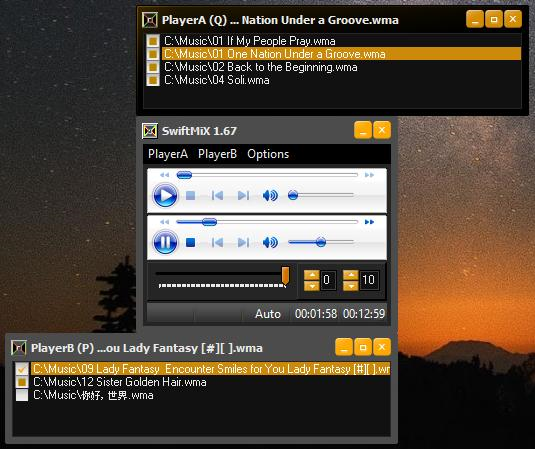

# swiftmix-rad-studio
SwiftMiX is a DJ-like music-mixer that uses Windows-Media Player Active-X components. It can import/export/convert most playlists and handles Unicode file-paths.

This project builds with Embarcadero RAD Studio 10.4 Community Edition

Free compiler: [Embarcadero C++ Builder 10.4 Community Edition](https://www.embarcadero.com/products/cbuilder/starter)

Before loading the project, you need to install the Windows Media Player Control as follows:
Click Component->Import Component->Import Active-X Control
Click Next and scroll down the list and choose Windows Media Player

Now you can click File->Open Project and choose SwiftMiX.cbproj

The project needs access to MFC header-files for its custom, subclassed open-file dialog.
If you run into problems, try adding $(BDSINCLUDE)\windows\sdk; to the resource-compiler include path:
Project->Options->Resource Compiler->Directories and Conditionals->Include File Search Path

Contact: dxzl@live.com

